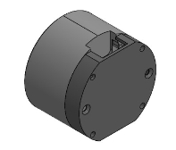

<!--
 * @Date: 2025-09-24 10:59:04
 * @LastEditors: ZHUOZHUOO
 * @LastEditTime: 2025-09-24 11:21:00
 * @FilePath: \undefinedf:\ZHUOZHUOO--Github\GIM3505_G474_Driver\README.md
 * @Description: Do not edit
-->
# GIM3505_G474_Driver
基于FOC_DRV8323项目开发的微型串联关节电机，GIM3505-8 V1.1电机体仅重86g，为微型机械臂的开发提供了可能。

由于FOC_DRV8323项目中使用的STM32G431KBU6的GPIO资源紧张，因此使用STM32G474CET6主控芯片，相较于FOC_DRV8323加入了NTC温度检测、外部晶振、拨码开关（快速设置CANID）

The miniature series joint motor developed based on the FOC_DRV8323 project, with the GIM3505-8 V1.1 motor body weighing only 86g, makes the development of miniature robotic arms possible. 

Due to the limited GPIO resources of the STM32G431KBU6 used in the FOC_DRV8323 project, the STM32G474CET6 is adopted as the main control chip. Compared to the FOC_DRV8323, additional features such as NTC temperature detection, an external crystal oscillator, and a DIP switch (for quick CANID setup) have been incorporated.

  
   
  <em>GIM3505电机设计图</em>

